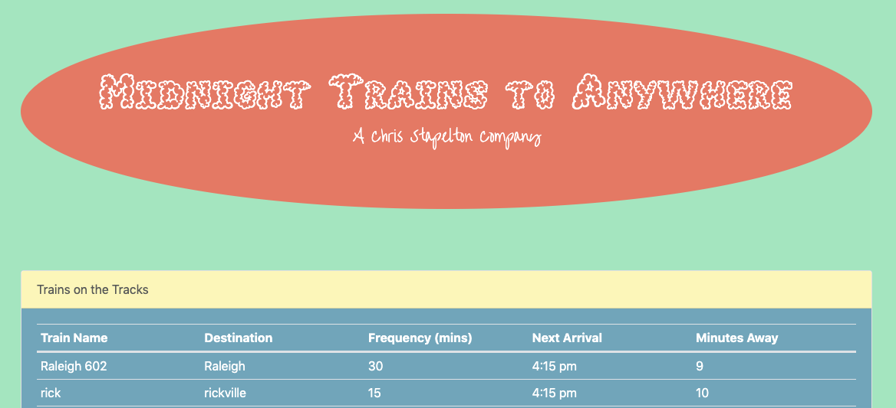
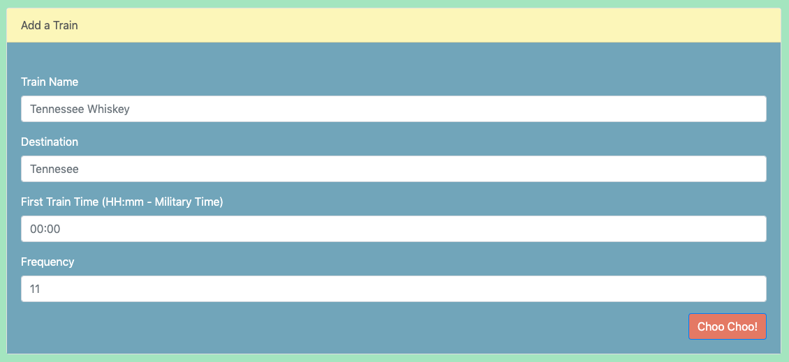

# Train-Scheduler

This web app is a product of me working with firebase to get a taste of how databases work and are integrated within web apps. This app allows a user to see all scheduled trains as well as add their own trains to the schedule. 

## Getting Started

Want to try it out?
Just follow this link: [Train Scheduler](https://ctslone.github.io/Train-Scheduler/)

* You can add a train to the schedule by filling out the input form.
* All user input data is stored in Firebase and then displayed to the user in real-time.
* All time data is displayed, calcualted and converted with Moment JS.

## Built With

* Javascript/jQuery
* Firebase
* Monent JS
* HTML5
* Bootstrap

## Authors

* Charlie Slone
    * [GitHub](https://github.com/ctslone)
    * [LinkedIn](https://www.linkedin.com/in/charlie-slone-704311a9/)
    * [Portfolio](https://ctslone.github.io/Updated-Portfolio/)
